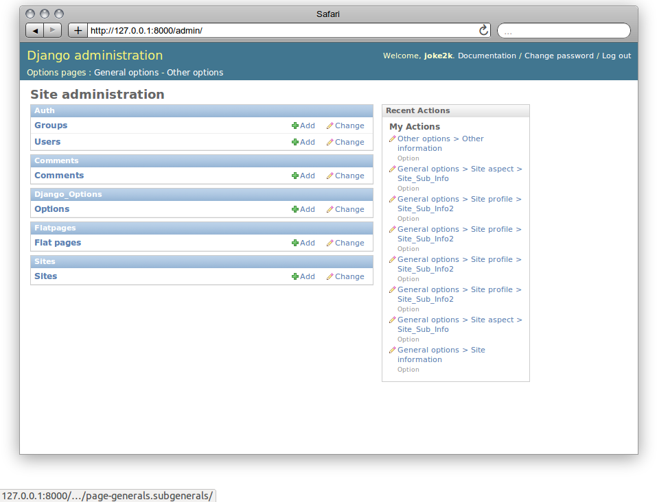
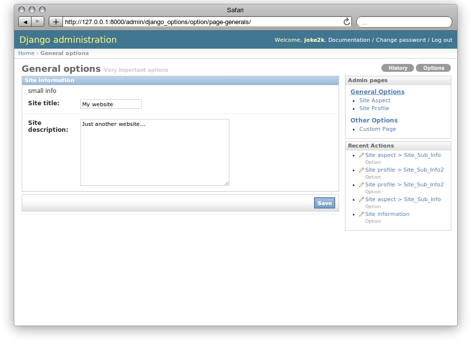

Django-options
==============

A easy way to manage Site options in your django applications.

Overview
--------

*   Use db to store a generic dict of options (with CRUD operations)
*   Stored values are converted to json string in a `PickledObjectField(TextField)`
*   Every option can be autoload to reduce queries, and is lazy decoded from pickled string
*   Every Site (django.contrib) has its options
*   Admin interface to edit options manually
*   Management command to manage options

Installation
------------

Requirements:

- django.contrib.sites
- django.contrib.messages
- `django-picklefield`_

Add django_options before 'django.contrib.admin' to extends `admin/base_site.html`
::

    INSTALLED_APPS = (

        'django_options',
        'django.contrib.admin',

        ...
        'django.contrib.sites',
        ...
    )

How to use APIs
---------------

Every action is executed with current SITE_ID provided by settings

::

    from django_options import add_option, get_option, update_option, delete_option

    get_option('welcome')
    > None

    get_option('welcome','default welcome')
    > 'default welcome'

    add_option('welcome', 'Hello world')
    > True
    get_option('welcome')
    > 'Hello World'

    update_option('welcome', 'Hello!')
    > True
    get_option('welcome')
    > 'Hello!'

    add_option('welcome', 'welcome if not already added')
    > False
    get_option('welcome')
    > 'Hello!'

    delete_option('welcome')
    > True
    get_option('welcome')
    > None

Autoloading
~~~~~~~~~~~
::

    from django_options import add_option

    add_option('welcome', 'Hello World', False)

add_option and update_option, but only add_option sets autoload field.
Autoloaded options is useful to reduce database queries.

Other helpers
~~~~~~~~~~~~~
::

    from django_options import *

    get_option('welcome')
    > None

    add_option('welcome' , 'Hello')
    > True

    option_is('welcome', 'Hello')
    > True

    option_not_is('welcome', 'Hello World')
    > True

    has_option('welcome')
    > True

    add_option('current_welcome', 'welcome')
    > True
    symbolic_option('current_welcome')
    > 'Hello'

Signals
~~~~~~~

Using APIs triggers a option_value_changed signal with `providing_args=["old_value","new_value","option"]`::

    from django.dispatch import receiver
    from django_options.signals import option_value_changed

    @receiver(option_value_changed)
    def my_handler(sender, *kwargs):
        ...

Administration
--------------

Django-options extends admin interface to integrate a minimal hierarchical pages system, to allow us to build options form easily.
Open `admin.py` in your application::

    from django import forms

    from django_options.admin import OptionsPage, admin_pages, option
    from django_options.forms import OptionsForm

    class GeneralsAdminPage(OptionsPage):

        title = "General options"
        description = "Very important options"
        code = 'generals'

        class SiteInfoForm(OptionsForm):

            code = 'site_info'
            title = 'Site information'
            description = 'Small description of this form'

            # options
            site_title = option( forms.CharField(max_length=255) )
            site_description = option( forms.CharField(widget=forms.Textarea) )

    admin_pages.register(GeneralsAdminPage)

This code, add a page called 'General options' to admin site, with a Form to edit `site_title` and `site_description` options.
The `option` function add a "is_option" attribute to field, allowing to recognize it when Form.save is called.
if you have any of the options that have keys with special characters, you can pass real option key name to `option` function::

    ...
    site_title = option( forms.CharField(max_length=255), option_key='site.title' )
    ...

|demo_image_home|

That's it, simple right?

OptionsPage and OptionsForm needs a definition of `code` initialized class field.

More Administration
~~~~~~~~~~~~~~~~~~~

You can build several pages and nest them, adding a field `parent=MyParentAdminPage`.
If you need you can add forms to a page as you like, as nested OptionsForm sub-classes or using `form_class_list=[]` field.
Latest approach helps to decide the sequence in which are shown the form

OptionsPage extends django FormView, but form_class is translated as first class in `form_class_list` field.
OptionsForm extends django Form, it means that you can do everything you wants, plus a `optionsets`::

    from django import forms

    from django_options.admin import OptionsPage, admin_pages, option
    from django_options.forms import OptionsForm

    class OtherAdminPage(OptionsPage):

        title = "Other options"
        description = "some options"
        code = 'others'

        class SiteInfoForm(OptionsForm):

            code = 'other_info'
            title = 'Other information'

            # options
            my_stuff =      option( forms.CharField(max_length=255), option_key='my.stuff' )
            some_stuff =    option( forms.CharField(max_length=255) )
            other_stuff =   option( forms.CharField(widget=forms.Textarea, required=False) )

            optionsets = (
                (None, {
                    'fields': (('my_stuff','some_stuff',),)
                }),
                ('Advanced options', {
                    'classes': ('collapse',),
                    'fields': ('other_stuff',)
                }),

    admin_pages.register(OtherAdminPage)

optionsets is a field that emulate the behaviour of ModelAdmin.formsets field.

|demo_image_page|

Options middleware
------------------

Site options can be initialized before view execution and destroyed after template render.
Useful to check global environment and to implement several aspects::

    MIDDLEWARE_CLASSES = (
        ...

        'django_options.middleware.OptionsLoaderMiddleware',
        )

    OPTIONS_LOADERS = ('app.options.TestOptionsLoader',)

and in `app/options.py`::

    from django_options import add_option, get_option, delete_option

    class TestOptionsLoader(object):

        @classmethod
        def load_options(cls, request):
            add_option('options_loader_prompted_value','This value is loaded and initialized in load_options() class method')

        @classmethod
        def unload_options(cls, request, response):

            delete_option('options_loader_prompted_value')

This methods are executed on `process_request` and `process_response` middleware hooks.

Per-view decorator
~~~~~~~~~~~~~~~~~~

Use decorator to simulate Options middleware process::

    from django_options.decorators import with_options

    def my_loader(*args): add_option('welcome', 'Hi!')
    def my_unloader(*args): delete_option('welcome')

    @with_options(loader=my_loader, unloader=my_unloader)
    def decorated_test_view(request):
        ... use 'welcome' option in view and template ...

Template tags
-------------

Django-options provides one tag `option` and two filters `option` and `or_option`::

     # load template tags and filters
      

      # used as tag ( site_welcome may be not exists )
      
      > None

      # used as tag with default
      
      > Hello world!

      # used as tag with assignment
      
      {{ my_welcome }}
      > Hello world!

      # used as filter
      {{ 'site_welcome'|option:'Hello world!' }}
      > Hello world!

      # the name of the option may be a variable containing a string
      {{ string_value|option:'Hello world!' }}
      > Hello world!

      # used as filter in if block tag
      
      {{ 'site_welcome'|option }}
      
      {{ 'Default welcome!' }}
      
      > Default welcome!

      # optional filter
      {{ not_existent_value|or_option:'site_welcome' }}
      > None

      # default value for unknown option name is None
      {{ not_existent_value|or_option:'site_welcome'|default_if_none:'Hello world!' }}
      > Hello world!

      # useful for default values, or_option is ignored when filtered value exists
      
      {{ existent_value|or_option:'site_welcome'|default_if_none:'0' }}
      
      > 42

      # nice uses with iterators
      {% for element in 'site_welcome'|option:'my-iterable-welcome-value' }}
      {{ element }}
      &nbsp;
      
      > m y - i t e r a b l e - w e l c o m e - v a l u e

      # or_option with iterators ( suppose that site_welcome option is setted to 'Ciao!' )
      {% for element in my_empty_personal_value|or_option:'site_welcome' }}
      {{ element }}
      &nbsp;
      
      > C i a o !

Management command
------------------

List of options
~~~~~~~~~~~~~~~

To display saved options from command line::

    $ python manage.py options

    +------+-------------------+---------------------+---------------------+-------------------------+----------+
    | Site | Option            |     Last change     |      Created at     | Value                   | Autoload |
    +------+-------------------+---------------------+---------------------+-------------------------+----------+
    |  1   | site_title        | 2013-01-01 10:08:22 | 2013-01-01 10:08:22 | My website              |   True   |
    |  1   | site_description  | 2013-01-01 10:08:22 | 2013-01-01 10:08:22 | Just another website... |   True   |
    +------+-------------------+---------------------+---------------------+-------------------------+----------+

by key::

    $ python manage.py options site_title

    +------+------------+---------------------+---------------------+------------+----------+
    | Site | Option     |     Last change     |      Created at     | Value      | Autoload |
    +------+------------+---------------------+---------------------+------------+----------+
    |  1   | site_title | 2013-01-01 10:08:22 | 2013-01-01 10:08:22 | My website |   True   |
    +------+------------+---------------------+---------------------+------------+----------+

ordered::

    $ python manage.py options --order key

    +------+-------------------+---------------------+---------------------+-------------------------+----------+
    | Site | Option            |     Last change     |      Created at     | Value                   | Autoload |
    +------+-------------------+---------------------+---------------------+-------------------------+----------+
    |  1   | site_description  | 2013-01-01 10:08:22 | 2013-01-01 10:08:22 | Just another website... |   True   |
    |  1   | site_title        | 2013-01-01 10:08:22 | 2013-01-01 10:08:22 | My website              |   True   |
    +------+-------------------+---------------------+---------------------+-------------------------+----------+

paginated::

    $ python manage.py options --per-page 1 --page 1

    +------+------------+---------------------+---------------------+------------+----------+
    | Site | Option     |     Last change     |      Created at     | Value      | Autoload |
    +------+------------+---------------------+---------------------+------------+----------+
    |  1   | site_title | 2013-01-01 10:08:22 | 2013-01-01 10:08:22 | My website |   True   |
    +------+------------+---------------------+---------------------+------------+----------+
    Page 1 of 2

To display options data uses `prettytable`_.

Editing
~~~~~~~

Add a string value::

    $ python manage.py options my_var --add 'my value'

    Add my_var: 'my value'

More complex value type::

    $ python manage.py options my_var --update 2 --eval

    Update my_var: 2

`--eval` option executes `eval(value,{},{})` with string provided value

::

    $ python manage.py options my_var --update '{"myvar":1}' --json

    Update my_var: {u'myvar': 1} json > '{"myvar":1}'

a real python dict (pay attention: json format supports a subset of python field)

if in `mymodule.py` has a function::

    def function( mystr ):
        return {
            'first_char' : mystr[0],
            'full_str' : mystr,
            'last_char' : mystr[-1]
        }

you can save the function results in `my_var` option with::

   $ python manage.py options my_var --update 'mymodule.function' --execute 'ciao'

    Update my_var: {'first_char': 'c', 'full_str': 'ciao!', 'last_char': 'o'} executed from "mymodule.function"

deleting `my_var`::

    $ python manage.py options my_var --delete

    Delete my_var

From future
-----------

* Option expires ( add_option('welcome', 'Christmas welcome', expires_at='26/01/2012') )
* Change autoload, expired_at and site_id from command line
* Inline option form editor

.. django-picklefield: https://www.github.com/shrubberysoft/django-picklefield
.. prettytable: http://code.google.com/p/prettytable/

